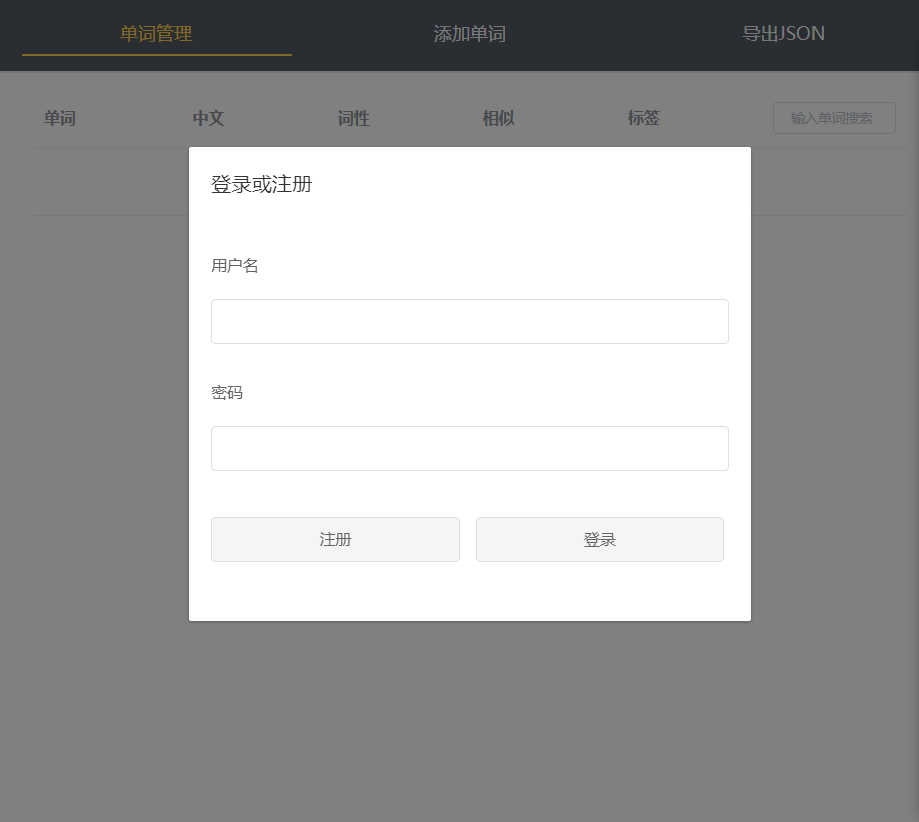
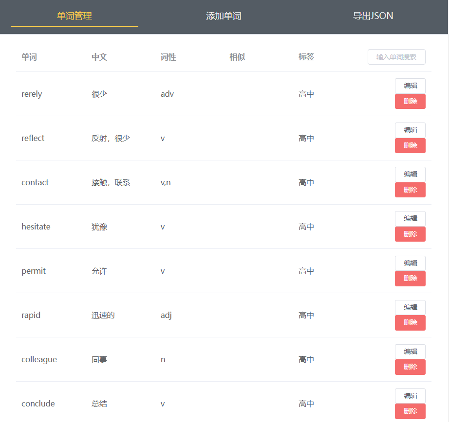
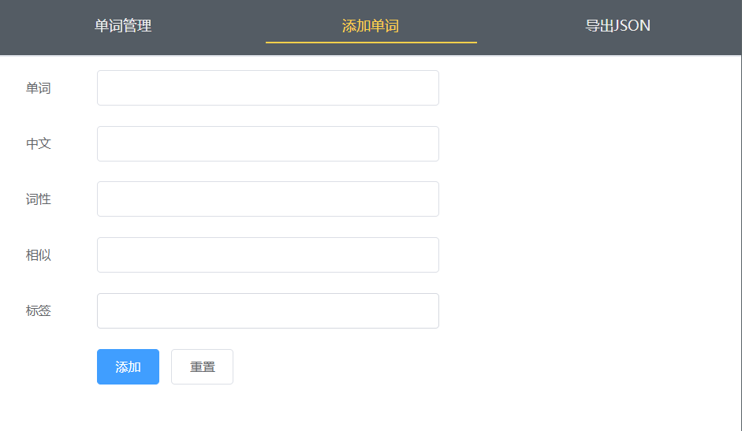
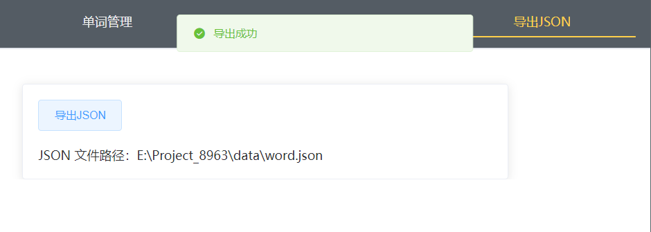
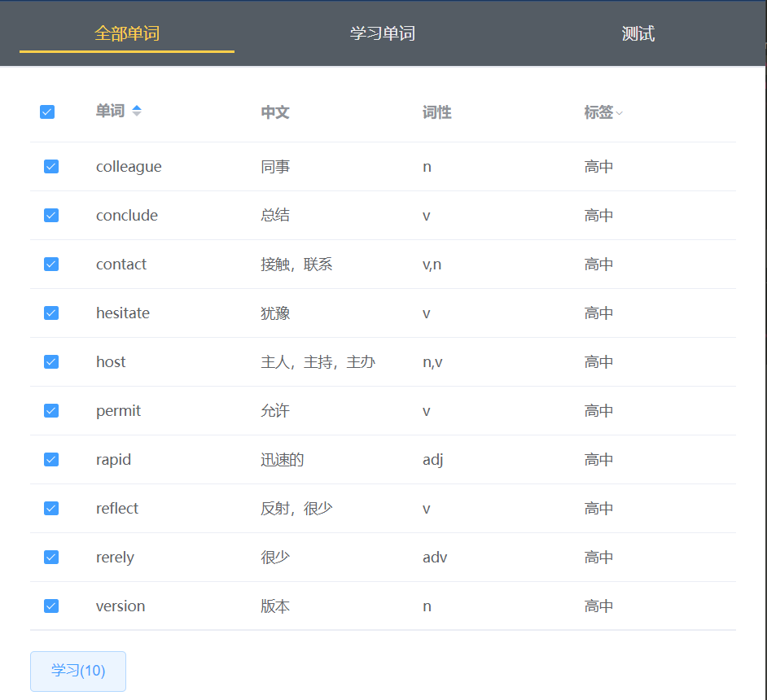
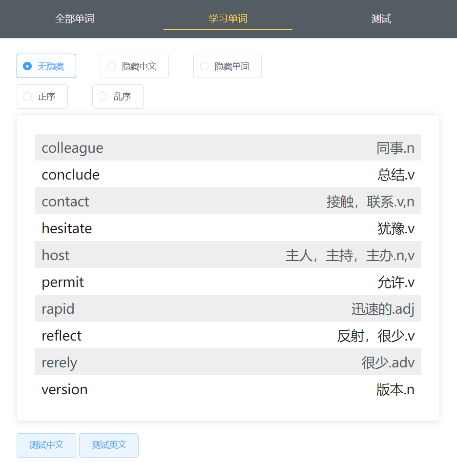
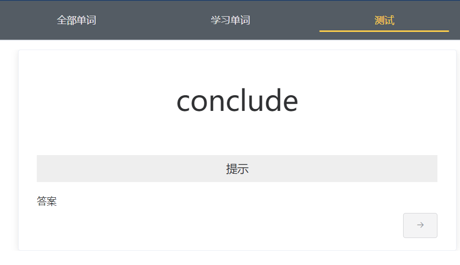
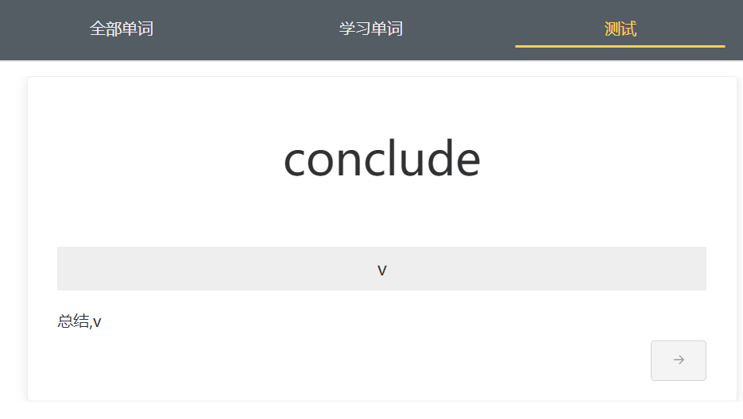

# 背单词

## 功能介绍

- 记录管理单词本
- 学习单词
- 对学习结果进行测试  

## 项目截图

### 后台管理单词本

登录 or 注册

管理单词本

向添加单词本添加单词

导出 json

进行单词学习时不使用网络请求向后台请求单词数据，而是将单词数据存为json文件

### 前台学习单词

选择学习的单词

进行单词学习

可以使用正序、乱序、隐藏中文意思、或隐藏英文意思不同方式加强对一个单词的印象

学习完成可以对本次学习的单词进行测试

测试时有提示和答案，可以对监测自己对每个单词的熟悉程度

测试中文时：

点击出现提示和答案，完成此单词测试后可以继续下一个

测试英文同理

## 技术栈

前端：Vue + Element

后端：Express + mongoose + JWT 验证

数据库：MongoDB

